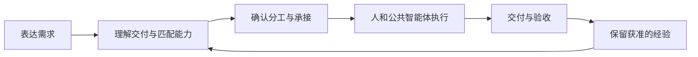

# Research Agent Platform · 任务与能力匹配平台

我们希望创建一个 AI 原生组织：用户提出要完成的事情，平台把合适的人和 AI 能力组织成可确认的协作方案，持续推进交付，并让获准留存的经验帮助下一次工作。

**长期方向是任务与能力匹配；当前从自己的科研小组入手，先把真实工作管起来。** 论文、项目、知识产权、材料和学生协作是任务场景，不是六套独立应用。初期验证组内有用，再验证相似课题组能否复用及谁愿意付费；跨行业市场和能力生态不预先当作成立。

成员通过统一浏览器入口协作。公共能力共同建设和使用，个人可以保留自己的工具与方法，只按约定交付结果。拟定技术路线仍为 **DeepSeek Harness 运行底座＋科研插件＋团队服务**，真实接入状态单独记录。

## 当前状态（2026-09-29）

**B2a/F2a 日常任务管理已共同复核，F2a-01 入口筛选问题已修复；完整 G2 和产品第一阶段尚未完成。** 在原有真实人类协作上，已接通保存草案找回、本人待回应/验收、实验室与本人任务总览、授权人员承诺及自报可用时间。复杂协调、AI 建议、Harness 持续执行和授权知识复用仍待后续交付。

共同受测代码为 `51f3d1b0adeb0846d5eec5cc8d5e0bf709121679`，契约 **0.3.0**。根 CI 149 项通过；真实浏览器 A9a 15 组、G1 主线 11 组（含服务重启）和 F1-01 专项 7 组通过，favicon 已修复。详情见[G2a 共同复核](docs/development/reports/G2a-overall-2026-09-29.md)。这些结论不代表 main 已合并、已经部署或小组试用通过。

| 内容 | 当前能力与边界 |
| --- | --- |
| 网页与团队 API | F2a/B2a 日常任务与人类协作可联调；未配置模型时明确提供手工方案 |
| 任务持久化 | 身份/会话、方案版本、承诺、文本交付与验收由服务端事务保存 |
| 实验室全貌 | 授权全量计数、分页任务、草案历史与人员安排已接通；定期检查快照，手动刷新变化 |
| 复杂协调 | 依赖、变更、取消/撤权、附件等扩展等待 B2b/F2b |
| [科研核心](packages/research-core/README.md) | 本地 Project/Artifact 与来源存取；不是多人平台的权威数据库 |
| [十项 Skills](agents/README.md)及[加载包](packages/research-skills/README.md) | 方法资源可构建和加载，不代表十项能力都能实际执行 |
| [Harness 适配](integrations/deepseek-harness/README.md) | 源码保留；最近安装核查受阻，真实调用未验证，本次未重新核查上游 |
| 记忆与能力进化 | 任务历史不等于完整长期记忆；权限内结论复用、能力维护仍需交付和验证 |

## 第一阶段要完成什么

用户说“我有一项工作要安排”，平台帮助明确交付要求、匹配本人/成员/公共能力，确认后产生真实安排。成员接受后用自己的方式工作；系统记录卡点、交付和验收；下次任务只复用有权使用的资料与结论。

入口采用用户已选择的[对话中展开协作单](docs/design/adaptive-responses.md)：创建任务、查看进度、寻找可承接工作按需展示不同组件。实验室总览和任务详情保留，用户无需先搭流程或维护多套看板。



完整目标见[产品规划 v0.4](docs/product-plan.md)。**当前优先读[第一阶段范围](docs/phase-one.md)**，它区分产品 P1、工程 G1 和暂缓功能。任务语义见[分配规则](docs/task-allocation.md)，实际收益见[试点计划](docs/validation-plan.md)，顺序见[路线图](docs/roadmap.md)。完整私人能力托管、公开市场、跨学校调度和学校行政系统不要求在 P1 一次完成。

## 下一批怎样开发

继续 **B2b/F2b：时间安排、依赖与阻塞、承诺变更、退出/转交、取消/撤权及附件**。后端先交付版本化契约和服务，前端复用当前界面完成真实联调；完整 A6—A9 通过后关闭 G2。随后接真实 AI、最小授权复用和组内试用。

[开发索引](docs/development/README.md)提供分工；[下一批可复制 prompt](docs/development/prompts.md#当前下一批-b2b--f2b)提供各自范围与停止点。双方从包含本次规划修订、B2a/F2a 和 F2a-01 修复的同一提交开始，不重开 F0/B0。

## 本地开始

建议 Node.js 24；要求 Node.js ≥ 22.19，pnpm 11.21.0。先检出交接指定的集成提交；单独 clone main 不保证包含本轮功能。

```sh
pnpm install --frozen-lockfile
pnpm run ci
```

真实 API、迁移、测试账号配置见[B2a 联调包](docs/development/b2a-handoff.md)，网页启动和环境变量见[前端说明](apps/web/README.md)。测试账号只用于合成验证；真实成员试用需要独立账号、访问边界、备份与运行支持。

```sh
# API 按联调包启动于 3100，APP_ORIGIN 与前端 origin 一致后
pnpm --filter @research-agent/web dev --port 4175
```

根 CI 检查文档、五个 workspace 包的构建/类型、共享契约、单测、后端真实进程和前端生产隔离。浏览器回归单独运行；Harness 与真实模型不在默认 CI 中。基础存储演示仍可用 `pnpm demo`，F0 视觉演示为独立 `dev:demo` 模式，两者都不能证明真实 AI 可用。

## 仓库结构与协作

```text
apps/web/                      F2a 网页与浏览器回归
apps/api/                      真实身份、权限、事务与任务 API
packages/contracts/            共享 Schema、路由与合成样例
packages/research-core/        本地科研对象与成果存储基础
packages/research-skills/      Skills 加载与打包
agents/skills/                 十项方法的唯一源文件
integrations/deepseek-harness/ 待联调的运行适配
evaluations/                   方法与效果验证材料
docs/                          规划、设计、开发指令与报告
```

每项工作用独立分支和可审查 PR，采用同一共同基线，不覆盖其他成员的工作目录。代码、方法和公开评测进入 Git；真实研究资料、私人方法、账号凭据和运行记录留在受控环境。提交代码不自动部署。

第一阶段成功取决于成员能独立承接、成果可用、协调与返工负担下降，以及下一次自然需求中的复用；不以任务数量、Agent 数量或 CI 通过代替。付费与跨组需求另行验证。

详见[贡献指南](CONTRIBUTING.md)、[AI 开发约定](AGENTS.md)、[迁移记录](docs/migration.md)和[来源说明](NOTICE.md)。我们使用并扩展 [DeepSeek Harness](https://github.com/deepseek-ai/deepseek-harness)，这是独立平台项目。
