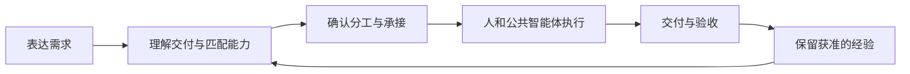

# Research Agent Platform · Personal Agent 与人机协作

**最终目标是以个人为中心的Personal Agent：采用类似微信的交流方式，人与Agent共用通讯录；个人助理根据任务类型和难度组织协作，积累获准的长期记忆，持续推进、主动跟进并从反馈中改进。** 科研小组是第一个验证场景，个人可以独立使用。

主代码仓库为 [luoyan96/personal-agent](https://github.com/luoyan96/personal-agent)，`main` 是共同开发主线。每个人 / AI 用独立分支提交 PR，开发环境、客户端检查和版本回退见[协作说明](CONTRIBUTING.md)。当前协作基线标签 `personal-agent-2026-10-06.1`，包含[三平台CI修复](https://github.com/luoyan96/personal-agent/pull/1)；初始导入标签保留。GitHub 代码更新和阿里云部署分别记录。

2026-10-06 Personal Agent 第一批功能已上线：本人长期偏好的保存 / 纠正 / 撤回、专项工作转交站内 Agent、服务端一次性提醒及“关于我”管理。API / worker787ca23、最终客户端27c3279，契约0.18 / 聊天1.7 / 显式迁移018。根CI521 + 2、客户端构建与本地13组界面流程通过；云端合成账号实际偏好保存 / 持久纠正、关闭页面后的提醒 / OpenIM投递 / 重开可见和最终简短回执分别通过。任务匹配采用合成模型验证，本批未调用真实厂商；完整行为学习、跨个人空间任务群、条件 / 周期跟进与策略自我改进仍在后续。新AI先读[当前状态](docs/current-state.md)、[产品规划v0.7](docs/product-plan.md)与[Personal Agent开发主线](docs/roadmap.md)。

## 历史更新：文件聊天

2026-10-06，Agent 文件聊天最终软件 `3b18c6883428f2f00bfbd61d8cce51195011b842` 已上线。个人 / 专属 Agent 私聊发送含文字 PDF 或 UTF-8 TXT / Markdown / CSV 后，真实 SDK 成功才开始解析和模型阅读；范围、部分读取与失败明确显示。默认总预算仍为 4000 / 90 秒。旧 SDK 对象网关需要重定向时，可使用“从本机选择阅读”，只重读原附件，不重复 IM 投递。详见[文件聊天交接](docs/development/agent-file-chat.md)。

最终共享 CI 473 项 + 2 生产入口、客户端类型 / Web / 四 SDK 资源通过；原首版两页 PDF 的真实模型失败保留。最终线上合成验收结果：0977381版本真实 SDK 上传936字节合成两页PDF后自动回复成功；最终3b18c68版本沿同一合成附件追问第2页，真实模型回复明确该页提取文字完整并指出tiny sample，当前消息范围第2页0–54与服务记录一致。没有读取、复制或改变真实 Key / 密码，没有新增云测试账号或推 GitHub。

Personal Agent面向个人的目标、联系人和协作网络：用户提出要完成的事情，平台把合适的人和AI能力组织起来，持续推进交付，并让获准留存的经验帮助下一次工作。

长期围绕个人助理、共同联系人、任务组织、长期记忆和主动跟进发展；科研作为首个场景。论文、项目、知识产权、材料和学生协作按具体目标组织；初期验证实际有用，再判断其他用户能否复用及谁愿意付费。

成员通过统一浏览器入口协作。公共能力共同建设和使用，个人可以保留自己的工具与方法，只按约定交付结果。拟定技术路线仍为 **DeepSeek Harness 运行底座＋科研插件＋团队服务**，真实接入状态单独记录。

## 历史状态（2026-10-05）

2026-10-05 23:20北京时间，加号菜单前端 `e536e759a71f59f244d740d2bfe25f2e5812bf56` 已静态上线：顶部添加朋友 / 创建 Agent / 发起群聊，输入区图片 / 文件 / 语音展开。API / worker仍为0ea0516，契约0.15 / schema16不变；八服务与精确公网首页通过。本地九组实际组件检查、客户端类型 / Web / 四SDK资源与既有Edge八组入口打开 / 取消检查通过。媒体回调与麦克风拒绝仅本地合成，本批没有重测云文件 / 录音投递。 入口与部署回退见[当前状态](docs/current-state.md)和[客户端说明](clients/openim/RESEARCH-CLIENT.md)。未推GitHub。

2026-10-05 22:25北京时间，[自然语言创建Agent并开始聊天](docs/development/natural-agent-creation-brief.md)已上线：向本人的个人助理明确说“帮我创建一个……Agent”，后台保存真实联系人和专属私聊，当前页面自动打开；相同档案复用。固定前端 / API / worker为`0ea0516d71d4f3c114f96ee0621ad463924a7a85`，契约0.15.0 / 聊天1.4.0 / schema16无迁移。完整CI457 + 2与完整客户端类型 / Web / 四SDK资源通过。既有IFRC真实创建“链研直言”、最终复用 / 自动SDK开聊、两轮真实模型继续回复和历史回执重开通过。首版导航及长人设预算问题已修，原失败证据保留；普通聊天按预算保留最近完整消息，当前输入、档案和获准记忆完整保留。准确版本、备份和限制见[接手说明](docs/current-state.md)，未推GitHub。

2026-10-05 20:34 北京时间，[文献阅读、论文修改、研究方案三种聊天助手](docs/development/agent-starters-brief.md)已上线：通讯录选择后保存本人联系人并开始私聊。前端固定 `a25ee9b`，API / worker 保持 `68d0592`。三档案真实本地验证与16组客户端交互闭合；既有IFRC实际添加文献阅读助手、打开SDK私聊、收到一轮真实角色回复并再次打开同会话通过。只处理提供的文本，不宣称新工具或自动科研执行；另两角色未单独调用真实模型。准确版本及证据见[接手说明](docs/current-state.md)，未推GitHub。

2026-10-05 17:33 北京时间，固定软件 `68d0592de941fa0f47907ba9df6e86fddd83f250` 已发布至[科研微信](https://chat.acceptcat.com)：无需邀请码个人注册、准确用户名添加好友、人与 Agent 自然私聊、个人模型 / API Key 管理和新版设置界面。普通聊天直接发送文本，需求 / 预算 / 材料收在可选协作中。契约 **0.14.0**、聊天 **1.3.0**、迁移 **016**；共享 CI **446 + 2**、完整客户端类型 / Web / 四 SDK 资源、**17 组真实本地 HTTP + 10 组组件合成传输**通过。新站两隔离个人账号的**14个真实HTTPS / SDK门禁**闭合，好友双向消息真实送达；既有IFRC账号自然聊天连续两轮真实回复通过。模型设置支持DeepSeek / 通义千问 / 豆包固定官方地址，通义与豆包真实Key调用尚未验证。部署备份和旧数据迁移核验通过，具体软件、证据及交接以[当前状态](docs/current-state.md)为准，范围见[本轮说明](docs/development/personal-chat-brief.md)。未推GitHub。

新 AI 或协作者先读[当前状态与接手说明](docs/current-state.md)和[项目进展日志](docs/project-log.md)，再按任务进入开发与部署记录。注册修复已于 2026-10-05 08:26 北京时间上线：密码最少 8 位，无复杂度组合 / 独立最大长度，用户名与邀请码仅去首尾空白，错误使用中文提示；实际 HTTPS 注册 / 登录 / 退出与测试账号清理通过。AGENTS 要求每批完成后同步更新交接入口和日志。

完整 OpenIM 科研微信已独立部署至新 ECS：[chat.acceptcat.com](https://chat.acceptcat.com)，文件使用 `https://files.chat.acceptcat.com`。上一批2026-10-05 13:58 北京时间，前端 / API / worker 统一发布 `979b7c10afb0b75b2a72572431cc08fb5195cf47`：精简 AI 输入协议与授权历史，完整计入模型缓存用量；修复状态详情挤塌输入框、发送后跳回旧消息和异步回复未自动跟随。根共享 CI **419 项 + 2 项生产入口测试**通过，独立客户端类型 / 构建 / 四个 SDK 资源及 6 项输入区、12 项滚动合成回归通过。已登录的新 IFRC 真实模型连续两次返回“收到一”“收到二”，完整总量 916 / 1214 Token，预算各为 4000；全程无手动滚动，编辑器保持可用。负责人已自行启用 `deepseek-flash`，本轮未读取或复制 Key。契约 **0.13.1**、IM 桥 **1.0.0**、迁移 **015**不变。最终一致备份核验及八服务 / HTTPS 健康通过；此前注册和双浏览器媒体证据保留受测版本，未冒充本轮重测。真实科研需求规划、组群、执行与交付闭环仍待独立验收。详见[新 ECS 部署与验收](docs/deployment/openim-ecs.md)。本批未推 GitHub；下文旧部署状态指 `research.acceptcat.com`，历史验收不替代新站记录。

此前以 [完整 OpenIM React/Electron 客户端](clients/openim/RESEARCH-CLIENT.md) 重建科研微信，源码位于 `clients/openim`。科研账号、人与 Agent 联系人、成员同意与任务权限使用现有权威 API，普通聊天和媒体接真实 SDK。契约 **0.13.0**、IM 桥协议 **1.0.0**、迁移 **015**；后端说明见 [桥接交接](docs/development/openim-bridge-backend-report.md)。[独立联调服务](deploy/openim/README.md)需要 Docker，包含派生身份校验服务。构建产物与服务连通分别验收，该批提交时尚未推 GitHub 或部署；实际新 ECS 状态以上段记录为准。

上一批本地完成[需求入口、群协作链条与页面完善](docs/development/chat-workflow-brief.md)：固定协调入口提供可编辑需求模板，任务群展示当前授权的承接、执行、最新交付、验收与下一步。邀请和执行建议复用任务命令的实际预检；修复邀请范围被轮询收起及窄屏发送按钮被挤出的问题。契约 **0.12.0**、聊天协议 **1.2.0**、迁移 **014** 保持兼容。最终源码 `cdf168d` 全量 CI **377 项**、真实 HTTP/SQLite/Edge 分阶段 **12 组**及 IAB 页面检查通过。验收使用合成 ModelCall；该批未推 GitHub 或部署。线上仍为下文所列的旧批次。

前一批本地新增[人与 Agent 联系人、档案与持续记忆](docs/development/agent-contacts-brief.md)：统一发现/添加/私聊，设定专属 Agent，维护稳定档案、性格与获准记忆，固定置顶“需求与协作”协调需求和任务群。契约 **0.12.0**、聊天协议 **1.2.0**、迁移 **014**。总控全量 CI 361 项、独立真实 HTTP 10 组及旧预览数据库 59 张原有表内容保留检查通过；后续前端修复的 98 项测试、构建、类型与生产隔离通过。Edge 真实协作 18 组与 IAB 桌面/320px 档案、记忆和私聊检查通过，已完成本地整合验收。本批未推 GitHub 或部署；记忆由用户明确保存，模型检查使用合成 ModelCall。以下保留此前通过记录。

此前本地批次已采用 OpenIM 客户端源码完善科研聊天：蓝白三栏界面、人与 AI 联系人详情、时间分组、成员独立未读与置顶、刷新草稿及会话失效清理。契约 **0.11.0**、聊天协议 **1.1.0**、迁移 **013**。全量 CI 338 项通过；最后前端修复后构建、类型、89 项前端测试及生产隔离通过。独立真实 HTTP 11 组、Edge 真实协作 11 组与 IAB 桌面/320px 发送验收通过。范围、源码来源与证据见[OpenIM 采用和整合验收](docs/development/openim-adoption-brief.md)。本批未推 GitHub、未部署；没有接入 OpenIM Server/SDK，也未新做真实模型调用。

此前“固定个人智能体私聊＋真人/AI 任务群”已完成[共同验收](docs/development/research-chat-overall.md)，用户授权将固定提交 `52629857c069761ff8ebf78a4141dc0975425b17` 部署 ECS，已完成备份恢复、重复迁移和线上合成验收，详见[ECS 记录](docs/deployment/ecs.md#2026-10-04-科研聊天升级已部署)。线上仍为该批次；生产真实模型和成功 AI 群协作闭环尚未验收。

网页、任务服务、worker 和科研聊天入口已在现有 ECS 上线，当前运行代码提交 `52629857c069761ff8ebf78a4141dc0975425b17`，契约 **0.10.0**、聊天协议 **1.0.0**、迁移 **012**。登录默认固定个人助理；实验室负责人仍可自行管理成员邀请码和本实验室模型设置，密码至少 9 个字符。已有真实账号、邀请码、材料和模型配置保留，部署前核查已有 1 个实验室启用模型，未读取或代用其 Key。独立无模型配置的合成实验室完成 HTTPS 和浏览器验收，三名验收账号已停用及撤销会话；真实模型调用、成功 AI 群协作、真实成员试用和 P1 仍待完成。维护规则见[注册说明](docs/deployment/registration.md)，备份/回退见[ECS 记录](docs/deployment/ecs.md)。以下 G5a 验收数字保留历史受测基线。

**G1—G3、G4a 和 G5a 已共同通过；下一步是实际运行与真实小组试用。产品第一阶段尚未完成。** 已能找回草案、查看本人待办及授权总览、记录成员承诺和可用时间，并在任务中处理依赖阻塞、安排变更、退出转交、取消撤权、附件与交付版本。

G5a 完整受测组合为 `1049ad300f4146045c36fd0b74aff63ed79e2aa6`，契约 **0.6.2**，回复契约 **1.0.0**。根 CI **258 项**，正式账号浏览器 7 组、历史浏览器 62 组，以及生产 HTTPS 协作、独立备份恢复均通过。详见 [G5a 共同复核](docs/development/reports/G5a-overall-2026-09-30.md)。该基线当时尚未合入 main、部署或通过真实小组试用；当前部署状态以上述最新记录为准。本轮无新增模型调用，既有真实 AI 证据见 G3/G4a 报告。

| 内容 | 当前能力与边界 |
| --- | --- |
| 网页与团队 API | F3 真实规划/同草案修改、授权查询、公共文本候选及后台运行已接通；保留人类协作 |
| 任务持久化 | 身份/会话、方案与承诺版本、附件引用、交付和验收由服务端保存 |
| 实验室全貌 | 授权全量计数、分页任务、草案历史与人员安排已接通；快照检查后手动刷新变化 |
| 协调与附件 | 已验收交付依赖、阻塞恢复、协商变更、转交、取消撤权及授权附件已验证；其余依赖类型和附件运维边界见 G2 报告 |
| [科研核心](packages/research-core/README.md) | 本地 Project/Artifact 与来源存取；不是多人平台的权威数据库 |
| [十项 Skills](agents/README.md)及[加载包](packages/research-skills/README.md) | 方法资源可构建和加载，不代表十项能力都能实际执行 |
| [Harness 适配](integrations/deepseek-harness/README.md) | 官方固定 0.2.0-rc.1 受限运行组合已安装并真实调用；旧六工具不用于团队 worker |
| 结论与公共方法 | 结论留存/授权复用、现有公共方法候选试跑与人工启停、本人请求及样例授权找回已共同验证；私人能力托管未开放 |

B5a/F5a 已共同通过账号维护、生产参考路径、恢复演练与首次使用验证；当时尚未部署。成员先读[一页使用指引](docs/first-use.md)。正式维护、启动与备份恢复见[B5a联调包](docs/development/b5a-handoff.md)及[阶段报告](docs/development/reports/B5a-backend-2026-09-30.md)。原业务权限规则见 [B4a 联调包](docs/development/b4a-handoff.md)；逐项真实证据及用量见 [G4a 报告](docs/development/reports/G4a-overall-2026-09-30.md)。根 CI 已覆盖新的 Harness runtime，真实模型专项仍须显式凭据。

## 第一阶段要完成什么

用户说“我有一项工作要安排”，平台帮助明确交付要求、匹配本人/成员/公共能力，确认后产生真实安排。成员接受后用自己的方式工作；系统记录卡点、交付和验收；下次任务只复用有权使用的资料与结论。

入口采用用户已选择的微信式个人助理私聊与任务群，人与智能体共享通讯录，聊天中的[协作单](docs/design/adaptive-responses.md)展示创建任务、邀请、执行和交付等受控操作。实验室总览和任务详情作为辅助入口，用户无需先搭流程或维护多套看板；该交互已完成本地工程与合成模型联合验收。



完整目标见[产品规划v0.7](docs/product-plan.md)，后续顺序见[路线图](docs/roadmap.md)。[第一阶段范围](docs/phase-one.md)保留科研P1 / 工程G1的历史划分；任务语义见[分配规则](docs/task-allocation.md)，实际收益见[试点计划](docs/validation-plan.md)。新增Personal Agent目标单独验收，完整私人能力托管、公开市场及学校行政系统不随目标更新自动开放。

契约 0.6.2 新增本人任务样例授权分页查询；0.7.0 新增邀请码注册；0.8.0 新增实验室负责人自助管理邀请码；0.9.0 新增本实验室大模型设置；0.9.1 当时将密码最短长度统一为 9 个字符；0.10.0 新增联系人、会话、消息、受控动作与智能体回复；0.11.0 新增每成员会话阅读位置与置顶偏好；0.12.0 新增公开档案、专属 Agent、联系人同意和版本化记忆；0.13.0 新增完整 OpenIM 身份与受控桥接；0.13.1 按用户要求统一 min8 密码、账号首尾空白处理和中文错误。新站迁移 015，旧站仍为 012。原前后端报告保留当时状态，以最新整合记录为准。

## 下一批怎样开发

个人智能体、任务群、[OpenIM 客户端采用](docs/development/openim-adoption-brief.md)及当前[联系人与记忆](docs/development/agent-contacts-brief.md)以前后端独立克隆分工、总控同步契约与整合提交，先向用户展示可操作本地版本；新功能不随开发自动部署。

聊天闭环通过后继续 **G5b：实际运行与小组试用**。负责人完成模型配置交接，再选择一项当前真实任务开始。步骤见[试用启动说明](docs/pilot-launch.md)。成员使用已部署的 HTTPS 入口。

2026-10-01 已完成现有 ECS 的独立服务、HTTPS 与合成协作部署验证；[ECS 部署说明](docs/deployment/ecs.md)记录实际状态，[部署准备包](deploy/ecs/README.md)供后续维护参考。

[开发索引](docs/development/README.md)提供当前分工；[历史 G5b 指令](docs/development/prompts.md#当前下一步-g5b)保留试用交接要求。新批次采用总控整合并验收的同一完整提交；G5a 报告保留历史基线。

## 本地开始

建议 Node.js 24；要求 Node.js ≥ 22.19，pnpm 11.21.0。先检出交接指定的集成提交；单独 clone main 不保证包含本轮功能。

```sh
pnpm install --frozen-lockfile
pnpm run ci
```

真实 API、迁移、测试账号配置见[B5a 联调包](docs/development/b5a-handoff.md)，网页启动和环境变量见[前端说明](apps/web/README.md)。测试账号只用于合成验证；正式维护与恢复工具已验证，实际主机/证书/成员账号仍需按试用安排配置。

下方仅为独立合成开发环境的网页调试命令；生产 HTTPS 运行按 B5a 联调包配置，不混用 HTTP 开发入口。

```sh
# 开发 API 为 3100，APP_ORIGIN=http://127.0.0.1:4175
pnpm --filter @research-agent/web dev --port 4175
```

根 CI 检查文档、六个 workspace 子包（含 Harness runtime）的构建/类型、共享契约、单测、后端真实进程和前端生产隔离。浏览器回归和需要凭据的真实模型调用单独运行。基础存储演示仍可用 `pnpm demo`，F0 视觉演示为独立 `dev:demo` 模式，两者都不能证明真实 AI 可用。

## 仓库结构与协作

```text
apps/web/                      任务协作、真实 AI、授权复用与浏览器回归
apps/api/                      真实身份、权限、事务与任务 API
packages/contracts/            共享 Schema、路由与合成样例
packages/research-core/        本地科研对象与成果存储基础
packages/research-skills/      Skills 加载与打包
agents/skills/                 十项方法的唯一源文件
integrations/deepseek-harness/ 已验证的受限运行适配
evaluations/                   方法与效果验证材料
docs/                          规划、设计、开发指令与报告
```

每项工作用独立分支和可审查 PR，采用同一共同基线，不覆盖其他成员的工作目录。代码、方法和公开评测进入 Git；真实研究资料、私人方法、账号凭据和运行记录留在受控环境。提交代码不自动部署。

第一阶段成功取决于成员能独立承接、成果可用、协调与返工负担下降，以及下一次自然需求中的复用；不以任务数量、Agent 数量或 CI 通过代替。付费与跨组需求另行验证。

详见[贡献指南](CONTRIBUTING.md)、[AI 开发约定](AGENTS.md)、[迁移记录](docs/migration.md)和[来源说明](NOTICE.md)。我们使用并扩展 [DeepSeek Harness](https://github.com/deepseek-ai/deepseek-harness)，这是独立平台项目。
